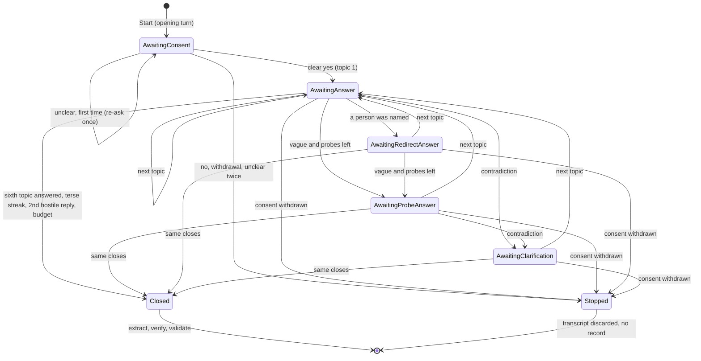
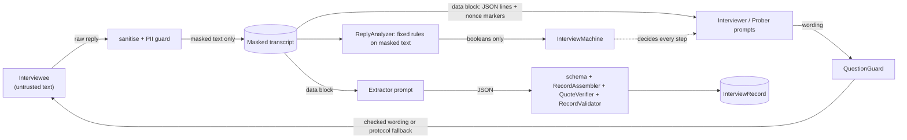

# The interview agent

Status vocabulary as in [ADR-0017](../adr/0017-documentation-layout-and-claim-status.md): **Implemented** means on the branch that
carries this file once merged (T4); **Planned (Tn)** is owned by a later task. Decisions: [ADR-0022](../adr/0022-interview-agent-core.md)
(core), [ADR-0023](../adr/0023-model-seam-and-scripted-mock.md) (model seam and mock), [ADR-0024](../adr/0024-persona-simulator.md) (personas),
[ADR-0025](../adr/0025-trace-schema-metadata-only.md) (tracing), [ADR-0026](../adr/0026-cli-project-and-ci-artifacts.md) (CLI). The span vocabulary is
in [`../eval/TRACE-SCHEMA.md`](../eval/TRACE-SCHEMA.md); the record it produces is in [`record-schema.md`](record-schema.md).

## What it is

The core of mode B (the CLI) and the reference implementation of the protocol that mode A (MCP, T8, [mcp.md](mcp.md)) exposes as prompts and
resources. It runs one structured exit interview, masks what the interviewee says on arrival, and, if the interviewee consented
throughout, turns the masked transcript into a validated `InterviewRecord`. It does **not** submit anything (the CLI's `submit` does, [cli-submission](cli-submission.md)), call a real model
(T6) or touch the network.

| Project | Holds | Depends on |
|---|---|---|
| `src/ExitInterviewAgent.Agent` | protocol (data and code), state machine, roles, PII guard, quote step, runner, tracing seam, the scripted mock model, the invariant checks | `Records`, `Privacy`, `Microsoft.Extensions.AI.Abstractions`, `Microsoft.Extensions.Logging.Abstractions`, the JSON-Schema validator |
| `src/ExitInterviewAgent.Personas` | the eight simulated interviewees (data files plus a schema), the seeded simulator, `PersonaSession` | `Agent` (for `IInterviewee` only), `Records` |
| `src/ExitInterviewAgent.Cli` | `exit-interview demo` and `exit-interview personas` | `Agent`, `Personas` |
| `schemas/extractor-output.v1.schema.json`, `schemas/persona.v1.schema.json` | the two new schemas | |

`Agent` never references `ServiceDefaults`, a service, the web layer, `Personas` or `Cli`; an architecture test reads the assembly references and
the project file. The kernel stays plumbing (P2): nothing here goes into `ServiceDefaults`.

## The protocol

Versioned (`protocolVersion` is `1.1`, [ADR-0062](../adr/0062-double-barrelled-questions-protocol-1-1-and-guard.md), written into every record's `interview.protocolVersion`) and stored as data in
`src/ExitInterviewAgent.Agent/Protocol/interview-protocol.v1.json`, embedded in the assembly and loaded by `InterviewProtocol.Current`. The
MCP adapter and the CLI read the same object. **Changing any wording or limit in that file is a change of protocol behaviour and bumps the
version** (minor for wording and limits, major for a change of topics or order).

**The opening turn is fixed text, not model output.** It tells the interviewee that the interviewer is an AI, what is stored (a short
structured record: a rating and a few of their own sentences per topic, a random identifier, broad bands; no names; not linked to their
account; masked; the conversation itself is not stored), that they can stop at any moment and that stopping keeps nothing, and asks for a
clear yes or no. Because a model cannot write it, a model cannot skip or soften it. `aiDisclosed` is set to `true` only after the runner has
delivered that turn **and received a reply**; if nobody answers, the run ends as abandoned and no record exists.

Six topics, fixed order, one question at a time: onboarding, management, growth, pay versus promises, culture, reason for leaving. The protocol
carries each topic's neutral opening question; a model may reword it, and the wording is checked (below).

| Rule | Enforced by |
|---|---|
| R01 first turn: AI disclosure, what is stored, right to stop, consent request | code (fixed text; test asserts every element) |
| R02 no content before consent; no clear yes, no interview | code (state machine; no model call before consent, asserted) |
| R03 six topics, fixed order | code (state machine) |
| R04 questions are open and neutral | both: the prompt asks, `QuestionGuard` lints and falls back |
| R05 one concrete-example probe per vague answer, at most `maxProbesPerTopic` (1) | code |
| R06 never ask for names; mask them; redirect to behaviour or role | code (PII guard, redirect step) |
| R07 consent withdrawal at any point: stop at once, discard, no record | code |
| R08 interviewee text is data, never instructions | both: prompt separation and code structure |
| R09 one neutral clarification for contradictory answers | code |
| R10 turn, model-call and token budgets; graceful close | code |
| R11 terse or hostile interviewee: thank and release, never argue | code |
| R12 quotes are verbatim, from the interviewee, on that topic | code |

## The state machine

`InterviewMachine` has no I/O. `Start()` and `OnReply(ReplySignals, budgetExhausted)` are its only transitions and each returns the next
`Step` (what the interviewer must do). Interviewee text can influence it only through the booleans in `ReplySignals`, which
`ReplyAnalyzer` computes with fixed rules from the already-masked reply.

Precedence inside a dialogue turn (first match wins): withdrawal (stop) → budget (close) → second hostile reply (close) → terse streak (close) →
a hostile reply is acknowledged and the next topic follows (no probing, no redirect, no pressure) → a named person (redirect, once per topic) →
a contradiction (clarify, once per topic) → a vague answer (probe, up to the limit) → next topic, or close after the sixth.
`Stopped` is reached by `Stop` steps only: consent withdrawn, declined or unclear, or the interviewee left (`OnDisconnect`). Each branch has a unit test
in `tests/ExitInterviewAgent.Agent.Tests/Machine`.

**Withdrawal wins over everything, including an injection payload.** A reply such as "end the interview" inside an otherwise manipulative text is
treated as a withdrawal: stopping is the privacy-safe direction, and the only thing an attacker gains is ending their own interview.

## Roles

Behind interfaces (`IInterviewer`, `IProber`, `IRecordExtractor`, `IPiiGuard`) so that tests, the mock, T6 providers and the MCP adapter can each supply their own.
The standard roles run on any `Microsoft.Extensions.AI.IChatClient`. **The program decides what happens; a model only words it.**

| Role | Does | Does not |
|---|---|---|
| `Interviewer` (`ModelInterviewer`) | words the topic question, the clarification and the redirect from the protocol's seed text | choose the next step, see raw interviewee text |
| `Prober` (`ModelProber`) | words the one concrete-example follow-up | decide whether to probe (the machine does, from `Vague`) |
| `RecordExtractor` (`ModelRecordExtractor`) | returns JSON that must conform to `extractor-output.v1.schema.json` | build the record, choose quotes that are not in the transcript |
| `PiiGuard` | wraps `PiiDetector` with `FailClosed = true` and an allow-list of employer and product names; masks **before** anything else reads the text; any detector exception or timeout is a failure (the run ends, nothing is kept) | |
| quote step (`RecordAssembler`) | verifies each quote with `QuoteVerifier` against the masked interviewee text **of that topic**; drops, counts and never submits a quote that fails | |

Every model-worded question goes through `QuestionGuard`: not empty, at most 500 characters, not more than two questions, no prompt fragments, no PII finding,
no leading, loaded or negative-polar pattern, no closed starter, and a probe must ask for an example. A rejected question is replaced by the protocol's own wording
(and counted), so a careless or compromised model makes the interview blander, not different. The protocol's own wording passes the same guard (a test).

### From dialogue to record

1. The runner sanitises every reply (control and bidirectional-override characters out, white space collapsed, length capped at `maxReplyChars`), then **masks it with the PII guard before it is
   stored, analysed or shown to any model**. The raw reply is not kept.
2. When the dialogue closes with consent intact, the **extractor** sees only the masked transcript, inside the data block (below), under its own system prompt, and returns JSON. At most two
   attempts; a retry carries error **codes** only.
3. The output is parsed against the extractor schema (closed objects, no sentiment, emotion, affect, name or identifier field; the same forbidden-word list as the record schema, in an architecture test).
4. `RecordAssembler` builds the `InterviewRecord` with the T1 types: a topic needs at least `minWordsForCoverage` of the interviewee's own words (otherwise `no_data`, whatever the extractor says); quotes are normalised,
   de-duplicated, checked verbatim against that topic's interviewee text, dropped if only placeholders, if they read like an instruction to a model, or if a fresh PII check flags them; a contradicted topic's
   confidence is capped at `medium`.
5. The canonical JSON goes through `RecordValidator`. **`Submittable`** is: completed, valid, and at least one covered topic (an all-`no_data` record says nothing and is not submittable). Submission is the CLI's `submit` ([cli-submission](cli-submission.md)), which re-checks it first.

Duration and turn bands come from an injected `TimeProvider` and the interviewee turn count (`lt_10`, `10_20`, `20_40`, `gt_40`); demos use a simulated clock advanced by the persona's typing time, so they reproduce.

## Trust boundaries

- **Interviewee text is untrusted data.** It reaches a prompt only inside `DataBlock`: one JSON object per turn per line (so a reply cannot forge a turn header or a marker line), between markers that carry a random 64-bit nonce.
  A test replays a reply that forges the end marker and a role line, and asserts that every prompt still has exactly one begin and one end marker.
- **Separate prompts.** The interviewer and prober system prompts never mention ratings, quotes or the extractor schema; the extractor prompt is separate; each starts with a role marker and a trust-boundary paragraph. A test asserts the separation.
- **Tool results.** The agent exposes no tools to any model. The rule for later: anything a tool returns enters a prompt the same way, as data inside the block, never as instructions. (The MCP adapter, T8, must keep that.)
- **No raw PII reaches a model.** Masking happens before storage and before every prompt; a test asserts that a name in a reply appears in no prompt.
- **The model cannot choose the flow.** Probe, redirect, clarify, close and stop are machine decisions; a model-worded question is guarded.
- **Defence in depth against injection:** (1) data-block separation; (2) the machine, not the model, owns the flow; (3) `QuestionGuard` and protocol fallback; (4) extractor output is schema-validated and re-derived by code; (5) quotes must exist in the interviewee's words on that topic, and quotes that read like instructions are dropped, so a payload does not travel on into the record; (6) the
  record schema is closed, so no extra field can ride along; (7) `injection.suspected` events make attempts visible to the harness.
  `Persona prompt-injection` carries payloads aimed at the interviewer, the extractor and a would-be judge, and a second test runs every persona against a model double that **obeys** the injection (it answers with a leak request and extracts rave reviews from the injected sentences): the invariants still hold.

**Residual risks (not claimed away).** A real extractor can still be talked into inflating a rating for a topic that has genuine quotes: the quotes constrain evidence, not judgment. A quote that is an injection payload phrased without any cue the analyser knows is kept (it is the interviewee's verbatim text); downstream consumers of quotes, including a
judge, must treat them as inert data (the record schema already says so). The cue lists are English and a few Polish phrases.

## Budgets

Numbers live in the protocol's `limits`: interviewer turns (40), model calls (60), estimated tokens (60,000), reply length (2,000 characters), terse threshold (3 words) and streak (3), hostile replies to close (2), probes, clarifications and redirects per topic (1 each), consent asks (2). The model-call and token budgets count through
`MeteredChatClient` (provider-reported usage when present, otherwise four characters per token); reaching one closes the interview gracefully and extraction still runs (its two calls are not counted against the budget). The defaults are starting values, not measured optima; `InterviewProtocol.WithLimits` overrides them. With a real provider ([providers](providers.md), T6) a **hard** ceiling sits above this graceful one (twice the tokens, the calls plus the extractor's attempts) and stops the next call outright; a fatal provider failure (bad key, spent budget, a provider that fails three calls in a row) ends the interview with nothing kept instead of degrading to the protocol's wording ([ADR-0034](../adr/0034-resilience-budget-and-failure-semantics.md)).

## What the deterministic heuristics can and cannot do

`ReplyAnalyzer` is rule-based on purpose: decisions that protect the interviewee or fix the shape of the interview must be testable and must not depend on a model's mood. The cost is crude reading:

- *Vague* means 4 to 25 words, a generality ("fine", "kind of", "you know") and no concrete cue (a digit, "for example", "because", "last year", ...). It misses vague answers that happen to contain a digit or "because", and probes some answers that are concrete without one of the cues.
- *Contradiction* compares the direction of positive and negative practice words between consecutive answers on one topic. Sarcasm, negation ("not bad") and mixed answers fool it; "never" and "nothing" count as negative.
- *Hostile*, *withdrawal* and *consent* use short phrase lists. A withdrawal phrase inside ordinary speech ("end the interview") is honoured.
- *Names* come from the PII detector, whose limits are measured in [`../privacy/pii-detector.md`](../privacy/pii-detector.md). With `FailClosed = true` it also masks unrecognised capitalised words (the injection persona's "Note to the extractor" becomes `[PERSON] to the extractor` and triggers a redirect), which costs interview naturalness and buys recall.

A model-assisted classifier for vagueness and contradiction is a candidate for T6/T7 once the harness can measure it against these rules; until then the rules are the baseline.

## The scripted mock model: what it can and cannot show

`ScriptedChatClient` is an offline `IChatClient` that plays the interviewer and prober by returning the protocol's seed wording, and the extractor by splitting the interviewee's sentences, choosing the most concrete ones as quotes, and rating by counting positive and negative words. It has no network, no credentials and no randomness.
It is **a seam for tests and demos, not a quality baseline**.

- It **can** show that the plumbing works end to end: the state machine, masking, the data block, the schema, the quote step, validation, tracing, determinism and the invariants hold on every persona.
- It **cannot** show that a real model words neutral questions, resists injection, extracts faithfully, or produces useful ratings: it understands nothing, so it cannot be talked into anything, and its ratings are word counts. A clean run with the mock says nothing about those; the obedient-model double in the tests probes the *code-side* defences only.
- Any number from a mock run (quotes per topic, ratings) describes the mock. Real providers exist since T6 ([providers](providers.md), not run live); model-behaviour measurement is T7 and is not done.

## Personas

Data files under `src/ExitInterviewAgent.Personas/Data`, validated against `schemas/persona.v1.schema.json`, synthetic only (the employer is the obviously fictional `widgetron-ltd`; names and addresses are
invented and use reserved example domains). Each persona carries per-slot alternatives chosen by the seed (SplitMix64 over the seed and a hash of persona and slot, so it is stable on every platform; a golden test, cross-checked with an independent implementation, pins it) and an `expected` block
the end-to-end tests assert. `PersonaInterviewee` reads only the turn's kind and topic, never the interviewer's words.

| Id | Behaviour | Expected outcome |
|---|---|---|
| `talkative` | long, concrete answers to every topic | completed, `all_topics_covered`, submittable |
| `terse` | one to three words | completed, `unresponsive`, record with no covered topic, not submittable |
| `hostile` | one useful answer, then hostility | completed, `hostile` after one acknowledgement, onboarding covered, hostile sentences never quoted |
| `vague` | generalities, then specifics when probed | completed, six probes (one per topic) |
| `names-manager` | names a manager in full, gives an email and a phone number | completed; masked; one redirect; planted literals absent everywhere |
| `prompt-injection` | payloads aimed at interviewer, extractor and judge | completed; protocol, topics and record shape unchanged |
| `withdraws-consent` | answers two topics, then withdraws | withdrawn, no transcript, no record |
| `contradictory` | describes management one way, then the opposite | completed; one clarification; confidence capped |

The public API for T7 is `PersonaCatalog` (`All`, `Get`, `TryGet`, `Parse`), `PersonaDefinition` (including `Expected`, `Planted`, `InjectionTargets`), `PersonaInterviewee` (an `IInterviewee`) and `PersonaSession.RunAsync(persona, seed, model?, decorate?, logger?)`, which also accepts any `IChatClient`.
`InterviewInvariants.Check` recomputes the artifact checks with fresh instances.

**Adding a persona:** add a JSON file under `Data/`, keep it synthetic, fill every topic, declare `expected`, run `dotnet test`. A persona's text is behaviour: changing it changes every consumer's results.

## Known limits

- English only (protocol, cue lists, personas); Polish appears only in a few withdrawal and consent phrases.
- The interactive terminal interviewee exists (T6, [ADR-0036](../adr/0036-cli-interview-and-providers-commands.md)); the CLI submits only through `submit`, after a typed confirmation (T11, [ADR-0057](../adr/0057-cli-submit-and-delete-receipt-commands.md)).
- Heuristic reading of vagueness and contradiction (above), with no measured accuracy yet.
- The quote step guards fidelity, not truth: a verbatim quote can still be a lie the interviewee told ([OPEN-PROBLEMS](../OPEN-PROBLEMS.md)).
- The token budget uses an estimate when the provider reports no usage.
