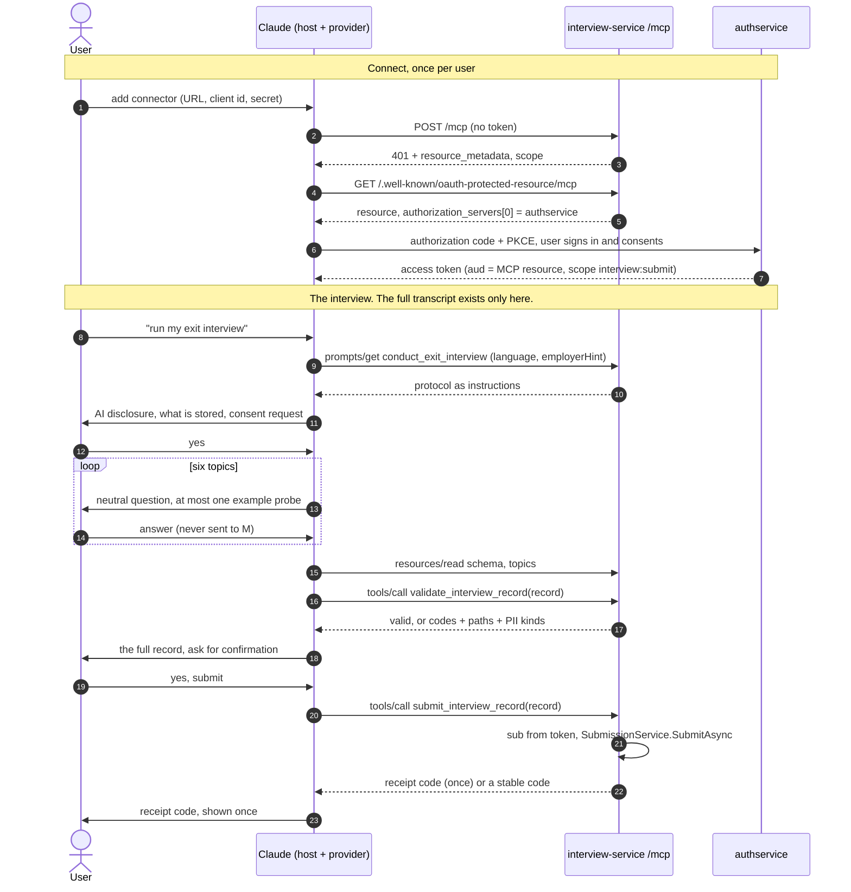

# The MCP server (mode A)

Status vocabulary as in [ADR-0017](../adr/0017-documentation-layout-and-claim-status.md). **Implemented** means on `main` once this lands (T8) and covered by the tests named below.
**Not verified** means it was not run against a real Claude client. Decisions: [ADR-0042](../adr/0042-mcp-sdk-and-streamable-http-stateless.md) (SDK, transport),
[0043](../adr/0043-mcp-transport-guard-and-closed-vocabulary.md) (guard), [0044](../adr/0044-mcp-tool-prompt-resource-contract.md) (contract),
[0045](../adr/0045-mode-a-host-fidelity-and-opening-note.md) (host fidelity), [0046](../adr/0046-mcp-not-found-and-error-vocabulary.md) (errors); authentication is [ADR-0012](../adr/0012-two-jwt-schemes-and-the-mcp-resource-server.md).
The operator steps are in [`../guides/connect-claude.md`](../guides/connect-claude.md).

## What it is

`interview-service` exposes an MCP endpoint at the path of `Mcp:Resource` (for example `/mcp`). The user's own AI client (Claude, through a custom connector) conducts the interview
by following a **prompt** this server publishes, builds the record, and submits **only the record** through a **tool**. The server never sees the transcript.

Code: `src/ExitInterviewAgent.InterviewService/Mcp/`, mounted by `McpEndpoints.MapMcpMount`. Package: `ModelContextProtocol.AspNetCore` 2.2.0 (Apache-2.0), Streamable HTTP, stateless.
Revisions the server accepts in `MCP-Protocol-Version`: 2024-11-05, 2025-03-26, 2025-06-18, 2025-11-25, 2026-07-28 (the SDK's list; a test pins ours to it).

## Sequence

## Who sees what

| Party | Sees | Does not see |
|---|---|---|
| The user | everything | |
| **Claude (the host) and its provider** | the **whole conversation**, the prompt and resources, the record, tool results incl. the receipt code | nothing is hidden from them; their retention is the user's own terms with them |
| **interview-service (this server)** | the access token's `sub`, `client_id`, `scope`; the prompt arguments (language, employer hint); the record, twice at most (validate, submit); request metadata | the transcript, the user's words other than the record's quotes, the user's email (claims minimised, [ADR-0014](../adr/0014-account-deletion-semantics-and-no-pii-in-telemetry.md)) |
| **authservice** | the account, the OAuth grant for the client | any interview content, employer, record |

## The trust boundary, and its limit

The host and its provider see the full transcript; this server sees only the record. That is the whole privacy proposition of mode A and also its weakness: **the host model, not this
project, conducts the interview.** Whether it discloses that it is an AI, obtains a clear yes, stops on request, asks neutral questions, uses verbatim quotes and masks names is up to
the host model following the instructions. The server cannot observe any of it. What the server does instead:

| Concern | Server-side check | What it cannot do |
|---|---|---|
| Schema, closed fields, no transcript field, size | `RecordValidator` (T1), 160 KiB record limit, 176 KiB transport limit | |
| Personal data left in quotes | `PiiScanner` on every quote and free field; refuses with kinds only | detect what a heuristic detector misses ([`pii-detector.md`](../privacy/pii-detector.md)) |
| AI disclosure | `interview.aiDisclosed` must be true | know whether it was actually said |
| One per employer per account | ledger ([`submission-flow.md`](submission-flow.md)) | |
| Verbatim quotes | **nothing** (the server has no transcript) | |
| Consent, stopping, neutrality, probes | **nothing** | |

That gap is why the evaluation suite exists: the same simulated interviewees (T4 personas) are to be run through mode A hosts and scored on the same metrics, so host fidelity becomes a number
([`../eval/METHODOLOGY.md`](../eval/METHODOLOGY.md)). **Today that number does not exist: fidelity of any host is unmeasured.**

## The contract

Pinned in full by [`mcp-contract.snapshot.json`](../../tests/ExitInterviewAgent.InterviewService.Tests/Mcp/mcp-contract.snapshot.json); any change to a word of it fails `McpContractSnapshotTests` until reviewed.

| Kind | Name | Notes |
|---|---|---|
| Prompt | `conduct_exit_interview(language?, employerHint?)` | one `user` message: trust rules, the verbatim opening and the provider note, six topics, question rules, record-building rules, validate then confirm then submit |
| Tool | `validate_interview_record(record)` | read-only, idempotent; dry run; codes, paths, PII kinds |
| Tool | `submit_interview_record(record)` | not read-only, not idempotent, not destructive; receipt code once |
| Resource | `exit-interview://schema/record/v1` | `application/schema+json` |
| Resource | `exit-interview://protocol/v1` | the protocol file as published |
| Resource | `exit-interview://topics/v1` | topics, status semantics, rating and confidence anchors |

Results contain `status`, `stored`, `code`, `errors[{code,path}]`, `piiKinds`, and on success `receiptCode` and a fixed notice. Never a byte derived from the submitted record.
Scope: one, `interview:submit`, checked by the HTTP policy and again per tool call.

## Protections, and the test that proves each

| Protection | Where | Test (`tests/ExitInterviewAgent.InterviewService.Tests`) |
|---|---|---|
| Two JWT schemes; web token refused, wrong audience refused, no token 401 with `resource_metadata`, missing scope 403 | T2 plus the mount | `Mcp/McpSecurityTests`, `Auth/TokenMatrixTests` |
| Per-tool scope; unknown tool closed | `McpToolScopes` | `McpSecurityTests` (also with the HTTP policy relaxed) |
| Origin allow-list; protocol version; transport size; no legacy SSE, no sessions | `McpTransportGuard`, stateless | `McpTransportGuardTests`, `McpSecurityTests` |
| Closed vocabulary for client-chosen names | `McpBodyScrubber` | `McpBodyScrubberTests`, `McpCanaryTests` |
| SDK message logging floor | `McpServerSetup.ClampSdkLogging` | `McpCanaryTests` (including a config that asks for Trace) |
| Content canary across the MCP path (record text, employer, argument names, prompt arguments, URI, tool name, header, Origin, token subject, malformed body, thrown verifier exception; receipt code) | | `McpCanaryTests` (the capture is proven to see the leak when the floor is removed) |
| Rate limit per account | `api` policy on the mount | `McpSecurityTests` |
| No sampling, elicitation or roots | assembly metadata scan, stateless | `McpSecurityTests` |
| Contract stability | snapshot | `McpContractSnapshotTests` |
| Prompt carries each required behaviour | `InterviewInstructions` | `McpPromptTests` (one named assertion per behaviour) |

Mutation checks run by hand on this branch (each change made, the MCP, canary, token-matrix and access suites run, the change reverted): no transport guard; no per-tool scope check; no SDK log floor;
no-op scrubber; mount without authorization; PII findings ignored; AI-disclosure check bypassed; submit using a fixed subject; Origin check off. Each made at least one test fail. They are not automated.

## Limits and residuals

- Host fidelity is not under our control and is unmeasured (above).
- The receipt code travels through the host: Claude and its provider can read it. Anyone holding it can delete the record ([ADR-0029](../adr/0029-receipt-deletion-semantics.md)).
- The employer hint is client-chosen text inside the prompt, reduced to 80 plain characters on a labelled data line; a hostile hint can still be 80 characters of persuasive words. Tested to add no line, heading or list item.
- The SDK logs `clientInfo` (name, version) of the connecting application at Information. Chosen by the application, not the conversation; not interview content.
- Unknown names get the SDK's own errors; a client can probe which names exist only by the answer, and the answer for every unknown name is identical.
- Not run: any real Claude client; the PostgreSQL variants of the submission tests (need `TEST_POSTGRES_CONNECTION`, CI sets it).
