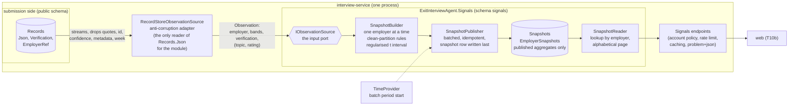

# Signals: aggregates that cannot be turned back into individuals

The Signals module turns stored records into employer aggregates with uncertainty, under disclosure-control rules, once per batch. It is a project inside `interview-service` with an
enforced boundary and a defined extraction path ([ADR-0002](../adr/0002-service-layout.md), [ADR-0052](../adr/0052-signals-module-boundary-input-port-and-store.md)). The rules and what they do and do not protect
against are in [`../privacy/AGGREGATION.md`](../privacy/AGGREGATION.md); this page is the shape of the code.

## Where it sits

Dashed: the clock decides *when*; nothing on a request path can start a publication. The module references the kernel and nothing else of the solution; the service names its types in the adapter, the registration extension and the
endpoint slice (architecture tests in both test projects).

## The input port, and what crosses it

`Observation` = employer reference, tenure band, optional seniority and function band, verification state, and a list of (topic, rating or null). No interview id, quote, confidence, metadata or week. The feed is a **full snapshot**
(a deleted record is absent next time), observations of one employer are contiguous, and the source streams. The wire vocabulary is the record schema's ([ADR-0007](../adr/0007-record-context-bands.md)), written out in `Vocabulary`.

## Publication, in order

1. `RunDueAsync` computes the batch period start and the fingerprint (`period | interval | rules version | k`); if the current snapshot has it (or a forced republish of it), stop.
2. Stream the feed through `SnapshotBuilder` (one `EmployerAccumulator` at a time: counters only), serialise each displayable `EmployerView`, write the rows in batches of 100 under a fresh snapshot id (invisible).
3. Insert the `Snapshots` row (sequence + 1). That is the publication. A unique fingerprint settles a race.
4. Delete rows of older snapshots; delete the older `Snapshots` rows. Failure at any point leaves the previous snapshot in place and invisible rows for the next run to remove.

## Store

| Table (`signals` schema) | Columns | Holds |
|---|---|---|
| `Snapshots` | `Seq` (key), `Id`, `Fingerprint` (unique), `PeriodStart`, `IntervalHours`, `RulesVersion`, `MinimumGroupSize`, `EmployerCount` | one row per publication; the batch start, never the moment a run finished |
| `EmployerSnapshots` | `SnapshotId`, `EmployerRef` (key), `View` (JSON) | the already-controlled view of one displayable employer |

No record, quote, interview id, receipt, rating column or any column a query could sort by; the migration test compares the migrated PostgreSQL schema with exactly these columns and the model has no pending changes.

## The web view (T10b)

`web/app` renders the two read endpoints at `/signals` and `/signals/[employerRef]` ([UI and UX](../ux/UI-UX.md#signals-screens); decisions [ADR-0067](../adr/0067-signals-pages-render-the-api-and-derive-nothing.md) to
[0071](../adr/0071-signals-browser-suite-absence-tests-and-mutation-proof.md)). The rule is that the view **shows exactly what the API returned and derives nothing**.

| Concern | Where |
|---|---|
| The strict reader: validates the contract, drops what must not be shown (numbers of an `insufficient_data` topic, cells of a suppressed cut, statistics of a `none` or `suppressed` band) | `web/app/lib/signals.ts` |
| Pure views, no arithmetic: the stat line (mean, interval and n in one string), the range bar, tables | `web/app/app/signals/views.tsx` |
| Fetching and failures: one read through the BFF, the browser's own cache, 429 with the service's wait and no retry loop, 401 to sign-in | `useSignals.ts`, `Failure.tsx`, `SignalsList.tsx`, `[employerRef]/SignalsEmployer.tsx` |
| Reference validation (the API's pattern, before any request; encoded when it becomes a path) | `web/app/lib/signals-ref.ts` |
| Caching and validators through the BFF | `web/app/lib/upstream.ts`, `lib/proxy-routing.ts`, `proxy.ts`, `app/api/proxy/[...path]/route.ts` ([ADR-0068](../adr/0068-signals-through-the-bff-caching-validators-and-429.md)) |
| The copy contract of AGGREGATION §8, as typed catalog strings | `web/app/lib/messages/en.ts` (`m.signals`, `m.deleteSubmission.publishedFigures`) |
| The contract mirror used by the browser suite | `tests/e2e/support/stub-backend.mjs` (contract note) |

Mutants run against this layer and killed (each fails a test): a count printed for an insufficient topic; a sort control on the list; the list re-ordered by the client; the reader keeping the overall of an insufficient topic;
the reader keeping the cells of a suppressed cut; n dropped from the stat line; `public` let through; a `304` treated as a redirect; `Retry-After` not passed; `ETag` not passed; the edge gate leaving every path to the route; the reference guard
loosened; a 400 made distinguishable from a 404; the route not forwarding `If-None-Match`; the page retrying a 429 by itself.

What was **not** verified: the view against the real service (the browser suite runs against the stub that mirrors the contract; the .NET side was not run in this task); a screen reader; whether readers understand intervals
([OP-26](../OPEN-PROBLEMS.md#op-26-readers-may-still-compare-employers-by-eye-and-nobody-has-tested-comprehension), [OP-28](../OPEN-PROBLEMS.md#op-28-the-signals-pages-have-only-met-the-stub)).

## Extraction path

To make `signals-service` a service: (1) implement `IObservationSource` over a streaming call from the interview side (or an event feed folded by the module) and delete the adapter; (2) give the module its own database (its data is
derived: republish instead of copying); (3) move the endpoint slice with the module, behind the same `account` policy, and let the web call it through the BFF; (4) keep one publisher. The builder, rules, statistics, publisher, reader and
contracts do not change. A future ADR records the move.

## Operations

`/health` shows the `signals` integration and check; metrics `signals.publications{outcome}`, `signals.publication.duration`, `signals.snapshot.employers`; one log line per publication. Configuration keys: [AGGREGATION §9](../privacy/AGGREGATION.md#9-configuration).
Demo data: `Signals:Demo:Mode=Seed` (Development only; [ADR-0056](../adr/0056-signals-api-caching-rate-limits-and-demo-data.md)).

## Tests, by layer ([testing-strategy](https://github.com/konradcinkusz/architecture-standards/blob/main/docs/guides/TESTING-STRATEGY.md))

| Layer | Where | What |
|---|---|---|
| Pure rules and statistics | `tests/ExitInterviewAgent.Signals.Tests` | the policy, the accumulator, the interval (coverage measured), the attack suite and its mutants, property tests with a fixed seed |
| Module with a store | same, InMemory + a fake clock | idempotence, restart, rollover, deletion, failure, orphan rows, health, metrics, logs, schema invariants |
| API and adapter | `tests/ExitInterviewAgent.InterviewService.Tests/Signals` | the real service in process: seeding through the real door, access, shape, caching, the not-found oracle, response scanning, rate limit, OpenAPI, demo data |
| PostgreSQL | same, `PostgresSignalsTests` | the module's migration, its own history table, the publish race, the whole path (skipped, and reported as not run, without `TEST_POSTGRES_CONNECTION`) |
