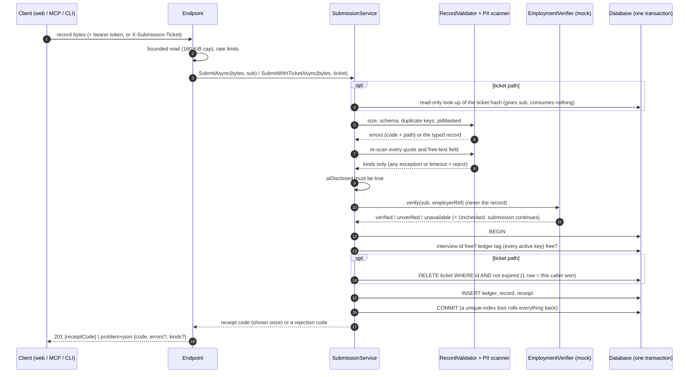

# Submission flow

How a record gets into the store, what each table holds, and what each table can and cannot be joined to. Everything here is
**Implemented** in task T5 unless it says otherwise, and tested; the decisions are [ADR-0027](../adr/0027-store-time-buckets-and-one-transaction.md)
to [ADR-0031](../adr/0031-submission-pipeline-and-employment-verifier-seam.md). Records are personal data
([ADR-0018](../adr/0018-records-are-treated-as-personal-data.md)); nothing here makes them anonymous.

## Entry points

| Path | Caller | Auth | Secret travels in |
|---|---|---|---|
| `POST /api/v1/submissions` | web (BFF) | policy `account` (web token) | `Authorization` |
| `POST /mcp/_submit` (Development only, replaced by the T8 tool) | MCP host | policy `mcp-submit` (MCP token, scope `interview:submit`) | `Authorization` |
| `POST /api/v1/tickets` | web (BFF) | policy `account` | `Authorization` |
| `POST /api/v1/submissions/ticketed` | CLI | none (anonymous) | `X-Submission-Ticket` |
| `DELETE /api/v1/receipts` | anyone with the code | none (anonymous) | `X-Receipt-Code` |

All of them end in one application service, `SubmissionService` (`Submissions/SubmissionService.cs`).

## Sequence

## Tables

| Table | Columns | Key | Purpose |
|---|---|---|---|
| `Records` | `Id` (interview id, 32 hex), `EmployerRef`, `Json` (canonical record), `Verification` (`Verified`/`Unverified`/`Unchecked`), `CreatedWeek` (Monday, `date`) | `Id` (the record's own random id) | the record; the week is used only to purge by age |
| `SubmissionLedger` | `Id` (random uuid), `KeyId`, `Tag` (HMAC hex, **unique**), `CreatedWeek` | `Id` | one submission per employer per account |
| `Receipts` | `Id` (random uuid), `CodeHash` (SHA-256 hex, **unique**), `RecordId` (FK, cascade) | `Id` | deletion by receipt code |
| `SubmissionTickets` | `Id` (random uuid), `TokenHash` (SHA-256 hex, **unique**), `Sub`, `ExpiresAt` (rounded up to 5 min) | `Id` | CLI tickets; deleted at redemption or expiry |

`tests/.../Persistence/SchemaInvariantTests.cs` pins exactly these columns (a new column fails the test until it is classified) and runs
against the EF model; the PostgreSQL tests compare the migrated database's `information_schema` with the same list.

## What each table can and cannot link

| | Holds an account-derived value | Holds anything that identifies a record | Can be joined to another table by |
|---|---|---|---|
| `Records` | no (no `sub`, no user id; the JSON has none either, ADR-0011) | yes (that is its job) | `Receipts.RecordId` only |
| `SubmissionLedger` | yes: `Tag`, an HMAC of (`sub`, employer) under a key the database does not hold | **no**: no record id, interview id, receipt, employer in the clear or foreign key | nothing by value. Only by timing and storage artefacts (below) |
| `Receipts` | no | yes: `RecordId`, and the hash of the code that deletes it | `Records` |
| `SubmissionTickets` | yes: `Sub` in the clear (the one table) | no: no employer, record or receipt, and the row is deleted at redemption | nothing by value |

Invariants (each has a test): **no table other than the ticket row holds a `sub`; the ledger has no column or foreign key that references a record;
no table holds both an account-derived value and a record-identifying one; every key is random (uuid v4 or the record's random id), never a sequence
or identity; the only stored timestamps are week buckets, plus the ticket expiry.**

### What is *not* hidden (read this as part of the table)

- **Hidden storage metadata.** Rows written in one transaction share a PostgreSQL transaction id and sit near each other in the heap. Someone with
  direct file or system-column access (or a physical backup) can pair a ledger entry with a record by those artefacts although no column links them.
  Random keys remove only the key-order channel. ADR-0027, threat model T-08 and T-09.
- **Key plus database.** With the HMAC key an operator can compute the tag for any account and employer and confirm a submission (T-08, accepted).
- **Timing at the edge.** Whoever sees live requests sees a ticket redemption and a record arrive together (T-09, accepted by the brief).
- **Deleting a record by receipt does not clear its ledger entry** (nothing links them), so that account stays closed to that employer until the ledger
  window passes (ADR-0028).

## Rejections (stable codes)

| HTTP | `code` | Meaning |
|---|---|---|
| 201 | none (body `{receiptCode}`) | stored; the code is never shown again |
| 400 | `NOT_JSON`, `DUPLICATE_KEY`, `NESTING_TOO_DEEP` | the body is not usable JSON |
| 400 | `INVALID_RECEIPT_CODE` | a malformed receipt code (typo) |
| 401 | `TICKET_INVALID` | unknown, expired, used, malformed or missing ticket: one answer |
| 403 | `EMPLOYMENT_NOT_VERIFIED` | only when the strict policy is on |
| 409 | `ALREADY_SUBMITTED` | this account already submitted for this employer in the window |
| 409 | `INTERVIEW_ID_TAKEN` | the interview id is already a stored record |
| 413 | `PAYLOAD_TOO_LARGE` | over 160 KiB |
| 422 | the record library's codes (`MISSING_FIELD`, `UNKNOWN_FIELD`, `LENGTH_LIMIT`, `PII_NOT_MASKED`, ...) with `errors: [{code, path}]` | schema violation |
| 422 | `AI_NOT_DISCLOSED` | the interviewee was not told the interviewer is an AI |
| 422 | `PII_DETECTED` with `kinds: [...]` | the re-scan found personal data (kinds only, never content) |
| 422 | `PII_CHECK_FAILED` | the re-scan could not complete; nothing stored |
| 429 | `TICKET_LIMIT` / `{error: "rate_limited"}` | too many live tickets / a rate limit |

Responses are RFC 9457 problem details (`application/problem+json`, `type` `urn:exit-interview-agent:problem:<code>`, `title` = the code). No code and no
message ever carries submitted text.

## Retention

A hosted service (`RetentionService`) waits for the schema, then every `Submission:Retention:SweepIntervalMinutes` (5) removes, in batches of 500:
records (and their receipts) older than `RecordMaxAgeMonths` (24, ADR-0019, an assumption), ledger entries older than `LedgerWindowDays` (365, ADR-0028)
and expired tickets. Age is measured to the end of the week bucket. It logs counts only.

## Configuration

| Key | Default | Notes |
|---|---|---|
| `Ledger:ActiveKeyId`, `Ledger:Keys:<n>:Id`, `Ledger:Keys:<n>:Secret` | none | required outside Development; secret is base64, at least 32 bytes, from the environment or a secret store |
| `Submission:Retention:RecordMaxAgeMonths` / `LedgerWindowDays` / `SweepIntervalMinutes` | 24 / 365 / 5 | |
| `Submission:Tickets:TtlMinutes` / `ExpiryGranularityMinutes` / `MaxOutstandingPerAccount` / `MintsPerAccountPerHour` | 15 / 5 / 3 / 10 | |
| `Submission:Receipts:ResponseFloorMilliseconds` | 150 | |
| `Submission:Limits:ReceiptDeletePerIpPerMinute` / `ReceiptDeleteGlobalPerMinute` | 6 / 60 | |
| `Submission:Limits:TicketedSubmitPerIpPerMinute` / `TicketedSubmitGlobalPerMinute` | 6 / 60 | |
| `Submission:ClientIpHeader` | unset | for example `Fly-Client-IP`; trusted only when set |
| `Submission:Verification:MockMode` / `RejectUnverified` / `TimeoutMilliseconds` | `unverified` / false / 2000 | |
| `Submission:Pii:FailClosed` / `AllowList` / `TimeoutMilliseconds` | false / empty / 5000 | |

## Not built here

The web screens (T9), the CLI client (T11), signals and aggregates (T10), a real employer registry and real verification (OP-1, OP-2).
