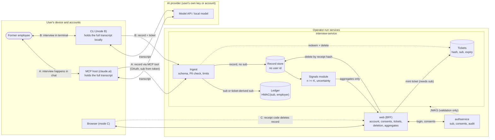

# Privacy design

Status vocabulary used in this document (and in the threat model): **Implemented** = on `main`, with a link;
**Planned (Tn)** = specified by the [brief](../architecture/PROJECT-BRIEF.md), owned by task *n*, not yet on `main`;
**Decided (Tn)** = a former proposal adopted into the brief by [ADR-0019](../adr/0019-brief-amendments-from-the-t3-legal-privacy-review.md), owned by task *n*, still not implemented; **Proposal** = this document's recommendation, not yet accepted by the owning task; **Assumption** = stated, not
verified. Nothing below is claimed as implemented unless it says so. As of this writing the only domain-relevant
code on `main` is the scaffold: an account endpoint ([`AccountEndpoints.cs`](../../src/ExitInterviewAgent.InterviewService/Endpoints/AccountEndpoints.cs)),
JWT validation against a JWKS, and an empty `InterviewDbContext`. See [ADR-0017](../adr/0017-documentation-layout-and-claim-status.md).

Companion documents: [threat model](../security/THREAT-MODEL.md), [legal considerations](../legal/CONSIDERATIONS.md),
[open problems](../OPEN-PROBLEMS.md). Binding inputs: [brief](../architecture/PROJECT-BRIEF.md) §2, §4, §6.

## 1. What is being protected, and from whom

A former employee tells an AI interviewer why they left. The value of the product is candour; candour exists only
if the person can trust that what they say cannot be traced back to them by the former employer, by the operator of
the service, or by anyone who later obtains the database. The design therefore tries to make three links hard:

1. **person ↔ record** (who said this?),
2. **person ↔ employer** (does this account belong to employer X? — the brief forbids modelling it, decision 3.1),
3. **record ↔ submission event** (when did this account submit?).

It also tries to keep the interview *transcript* out of our systems entirely (modes A and B).

**Honest framing.** "No user id in the record" is a property of the schema, not proof of anonymity. Verbatim quotes,
tenure/role bands and the employer field can identify a person in a small team, and quotes are free text a person
can recognise by style. [ADR-0018](../adr/0018-records-are-treated-as-personal-data.md) records the stance this
design takes: **records are treated as personal data (at best pseudonymous), never as anonymous**, and every control
below is built on that assumption. Whether they are legally anonymous is a question for counsel
([CONSIDERATIONS §2](../legal/CONSIDERATIONS.md)), not something the architecture can assert.

## 2. The data we hold

| Store | Holds | Never holds | Status |
|---|---|---|---|
| **authservice** (own DB, own key) | account (`sub`, email, credentials), consent rows, its own audit events, OAuth grants for MCP clients | any interview content, employer, record, ledger entry | Implemented as a pinned image ([ADR-0003](../adr/0003-identity-authservice-as-pinned-image.md)); authservice's audit/consent/export behaviour is read from [its docs](https://github.com/konradcinkusz/authservice/blob/main/docs/issue-analysis.md) |
| **Record store** (`interviewdb`) | the versioned record: per-topic rating (1-5 or null), verbatim supporting quotes, confidence, PII-masked flag, `aiDisclosed` flag, pseudonymous interview id, employer id, coarse bands, receipt-code **hash** | user id / `sub`, account email, IP, user agent, receipt code in clear | Planned (T1 schema, T5 store) |
| **Submission ledger** (separate table, ideally separate schema/DbContext) | keyed HMAC of (`sub`, employer id); key version; day-level (or no) creation timestamp | content, record id, interview id, receipt hash, IP | Planned (T5) |
| **Ticket table** | hash of a random ticket, `sub` it was minted for, expiry | employer, record, content | Planned (T5, mint UI T9, redemption by CLI T11) |
| **Signals read model** | aggregates per employer × topic with n and uncertainty, only n ≥ K | individual records, quotes | Planned (T10) |
| **Logs / traces / metrics** | request metadata: route, status, latency, size class | content, quotes, employer, `sub`, receipt codes, tickets, IP beyond what the platform adds | Planned (T5/T6 enforce; kernel telemetry exists, see [`00-ARCHITECTURE.md`](../architecture/00-ARCHITECTURE.md) P15 row) |

Model access is behind `IChatClient` (brief §4); the project hosts no model, so the AI provider is *outside* this
table by design and appears in the who-sees-what table below.

## 3. Data flow

Reading the diagram: the dashed `ING → TKT` edge is the ticket redemption correlation point (§6.4); the dotted
`AUTH → IS` edge is key distribution only, never user data. The transcript exists in exactly two places per mode:
the user's device and the AI provider. It never reaches an operator-run service in modes A and B.

## 4. Who sees what, per usage mode

Legend: **T** = full transcript, **R** = the submitted record, **S** = the account `sub`, **E** = employer id,
**L** = ledger entry, **—** = nothing. This is the design's intent; it holds only where the status says so.

| Party | A: MCP (Claude host) | B: CLI (own key / local model) | C: Web |
|---|---|---|---|
| **The user** | T, R | T, R, the ticket | account, own consents; no list of own records (by design, no link) |
| **MCP host** (the AI client the user chose; today claude.ai only, [brief §3.2](../architecture/PROJECT-BRIEF.md)) | **T**, R, and the tool-call arguments, subject to the host's own terms and retention | not involved | not involved |
| **AI provider** | the host's provider sees T under the user's own account terms | **T** under the user's API terms (or nothing, with a local model) | not involved (the web runs no model) |
| **interview-service (ingest)** | R, S (from the OAuth token) at the moment of submission; **never T** | R, S (only via ticket redemption); **never T** | S on authenticated calls; never R except by receipt-hash lookup |
| **Record store after commit** | R (no S) | R (no S) | R (no S) |
| **Ledger** | L = HMAC(S, E) | L | — |
| **authservice** | S, account data, consent/audit events; **no R, no E** | S at ticket-mint time only (it authenticates the web login) | S |
| **Operator (DB access only)** | R, aggregates; ledger rows are opaque without the key | same | accounts via authservice DB |
| **Operator (DB + HMAC key)** | can test "did account S submit about employer E?" (§6.3) | same | same |
| **Operator (DB + key + live traffic/timing)** | additionally can correlate by time (§6.3, §6.4) | same | same |
| **Employer / public** | aggregates only, n ≥ K, with uncertainty; never an individual record | same | same |

Two consequences worth stating plainly:

- In mode A the **server cannot verify that quotes are verbatim**, because it never sees the transcript. In mode B
  the transcript is on a machine we do not control. Both submit *claims*; transcript fidelity is a property the eval
  harness measures on simulated interviews ([methodology](../eval/METHODOLOGY.md)), not something ingest can enforce.
- In mode A the **PII guard must run server-side** on the submitted record, because the host model is not ours.
  Names that the host model let through into quotes are caught (or not) by ingest, not by the interview.

## 5. The mechanisms

### 5.1 Record without a user id (Planned, T1/T5)

The record schema has no `user_id`, `sub`, email or account reference; the interview id is a random pseudonymous
identifier unrelated to any account. Brief §6 lists the topics (onboarding, management, growth, pay vs promises,
culture, reason for leaving). Controls on what *is* in the record:

- **Verbatim quotes only, capped in length and count**, PII-masked before storage. Free text is the main
  re-identification and defamation vector; a length cap is also the cheapest mitigation. *Proposal:* cap quote length
  and count in the schema (T1), and treat the cap as part of the privacy contract, not a UX choice.
- **Coarse bands, not exact values** for tenure and role family. *Proposal:* the band set is chosen against the
  smallest realistic group (see §5.5 and [OPEN-PROBLEMS](../OPEN-PROBLEMS.md)).
- **Coarse timestamps.** *Decided (ADR-0019, not implemented):* the record carries no timestamp finer than an ISO-week bucket, and the ledger
  none finer than a day (or none at all), so row timing does not become a join key (§6.3).
- Every record from a client is untrusted input: schema validation, PII detection, rate and size limits
  (brief §6, T5).

### 5.2 Submission ledger (Planned, T5)

Purpose: enforce **one submission per employer per account** without storing "account X submitted record R".

- Row = `HMAC-SHA-256(key_vN, sub ‖ employer_id)` plus key version and a coarse creation bucket. No content, no
  record id, no interview id, no receipt hash (brief §6).
- The key is **rotatable**: the active key is used for new entries and every key still inside the retention window
  is tried on lookup. Rotation therefore does not reset deduplication as long as old keys are kept for the window.
- Entries are **purged after a configurable window** (brief §6). After the purge the same account can submit again
  for the same employer; that is the price of not keeping a permanent "this account wrote about that employer"
  index, and it is a deliberate trade-off, not a bug.
- **Limits, stated honestly.** The employer-id space is small, so anyone who holds the key can brute-force
  "did account S submit about employer E?" for every E. The HMAC protects the ledger from someone who has the
  database but **not** the key; it does not protect against an operator who has both (brief §6 says so; the threat
  model lists it as a residual risk). Keep the key outside the database's backup domain (platform secret, not a DB
  column) so a database leak alone does not hand over both.
- Deleting a record by receipt code does **not** remove the ledger entry (the link does not exist, by design). A
  user who deletes cannot resubmit for that employer until the entry is purged. This is documented user-facing
  behaviour, not a defect.

### 5.3 Deletion by receipt code (Planned, T5 server, T9 web)

On submission the server returns a random receipt code once and stores only its hash.

- The code is a bearer secret. *Proposal:* ≥128 bits from a CSPRNG, URL-safe encoding; a fast hash is then
  adequate because the input is high-entropy, and lookup by hash must be constant-time with identical responses and
  comparable timing for "unknown code" and "already deleted" (enumeration, see threat model). Follows the
  recurring rule in [`security-review`](https://github.com/konradcinkusz/architecture-standards/blob/main/docs/guides/SECURITY-REVIEW.md) §5
  (a GUID is not a secret).
- Presenting the code deletes the record. Because the code is not tied to any account, **anyone holding the code can
  delete the record**, and **a lost code means the user cannot delete it**. Both are inherent to unlinkability.
- Deleting an *account* (authservice soft-delete + reaper, [identity guide](https://github.com/konradcinkusz/architecture-standards/blob/main/docs/guides/IDENTITY-AND-ACCOUNTS.md) §8) cannot delete
  the person's records, because nothing links them. The UI must say so before the user deletes the account and
  tell them to use their receipt codes first. (Tension with GDPR erasure: [CONSIDERATIONS §2](../legal/CONSIDERATIONS.md).)
- Deleting a record can drop a group below K. Aggregates must be recomputed from the remaining records and
  withdrawn when n < K (Planned, T10); backups age out on the platform's schedule (state it in the retention table).

### 5.4 Submission tickets for the CLI (Planned, T5/T9/T11)

The CLI cannot hold an OAuth client secret, and authservice registers only confidential clients (brief §4), so:

1. The web panel, authenticated through authservice, mints a ticket: random (≥256 bits), short-lived, single-use,
   **not bound to any employer**; the server stores its hash with the `sub` and an expiry.
2. The CLI sends the record plus the ticket.
3. Redemption yields `sub` once; the ledger entry is computed from it, the record is stored without it, and the
   ticket row is deleted.

Residual risk (brief §4): the **redemption instant is a correlation point**. At that moment one request carries a
ticket (resolvable to `sub`) and a record. The mitigations below narrow, but do not close, that window:

- no ticket, `sub`, record or employer in logs/traces (the telemetry rule, §5.7);
- ledger entry and record written in **separate transactions** from non-adjacent commit points, with coarse
  timestamps (*Proposal:* queue records and commit in batches, or add jittered delay, so insertion time is not the
  ticket's redemption time to the second);
- ticket rows deleted at redemption and expired rows swept on a short schedule, so a database snapshot taken later
  contains few `sub`↔time pairs;
- tickets are not employer-bound, so the ticket table never says *which* employer.

An operator who records live request timing at the edge (reverse proxy, platform logs) can still join ticket
redemption to record insertion. That is listed in the [threat model](../security/THREAT-MODEL.md) as a residual
risk, not as solved.

### 5.5 Aggregates: k-threshold, uncertainty, no ranking (Planned, T10)

- Published only when n ≥ K (configurable, default 5; brief §6). The default is the brief's number, not a
  privacy guarantee: K = 5 is a convention, and its adequacy depends on band granularity (open problem).
- **K applies to every cell that is shown**, not just the employer total. *Decided (ADR-0019, T10):* any cut by band or topic that
  has fewer than K records is suppressed, and suppression must not be undoable by subtraction (if the total and all
  but one small cell are shown, the hidden cell is exposed). Show total and one cut, not the cross-product.
- **Differencing.** A live aggregate that moves from n = 5 to n = 6 discloses the sixth record's contribution to
  anyone who watches. *Decided (ADR-0019, T10):* publish on a schedule or in batches, not per submission.
- **Uncertainty on every number**: sample size and an interval travel with each value in the same payload
  ([metric-ethics §3](https://github.com/konradcinkusz/architecture-standards/blob/main/docs/guides/METRIC-ETHICS.md)). With n = 5 on a 1-5 scale the interval is wide; the UI states that plainly.
- **No composite employer ranking and no per-person view**, enforced architecturally, i.e. by absence: there is no
  query, endpoint or table that sorts employers on a single score or lists records for a person. The Signals module
  has its own project, schema and DbContext with no shared domain types (brief §4, [ADR-0002](../adr/0002-service-layout.md)).
- Individual reviews are never published (brief §2). See [CONSIDERATIONS §3](../legal/CONSIDERATIONS.md).

### 5.6 Consents and accounts (Planned, T2/T9)

Portal login is an **account only**, with no link to an employer (brief §3.1). Versioned legal consents live in
authservice ([identity guide §9](https://github.com/konradcinkusz/architecture-standards/blob/main/docs/guides/IDENTITY-AND-ACCOUNTS.md)): immutable rows with document, version, timestamp, IP, user agent, locale.
Two design consequences:

- authservice necessarily holds IP and user agent for consent rows; that is identity-side data and is the reason the
  ledger and tickets must never be joined to it in logs.
- Consent **to our terms** is separate from consent to **interview processing**; consent *withdrawal mid-interview*
  stops the interview and discards the transcript on the client (agent rule, brief §6; T4/T7 test it as a persona).
  What is withdrawn after submission is handled by receipt-code deletion.

### 5.7 Telemetry and audit without content (Planned, T5/T6; scaffold partly Implemented)

Brief §6: no PII or interview content in logs, traces or authservice audit events. The scaffold already exports
traces by OTLP only when configured and filters probes ([`00-ARCHITECTURE.md`](../architecture/00-ARCHITECTURE.md), P15 row);
that is plumbing, not yet a content guarantee. The enforceable form (T5/T6):

- spans and logs carry route, status, latency, size class, model name, token counts: never prompt text, quotes,
  employer, `sub`, receipt code or ticket;
- a test that submits a record containing a unique canary string and asserts the canary appears in no log line, span
  attribute or audit event (a test that cannot fail is worse than none: it must fail when logging is added);
- the eval harness's traces for **simulated** interviews may carry content (they contain no real data); the same
  span schema in production does not. The two must be separated by configuration, not by hope.
- authservice audit events record account actions (role changes, etc.); the interview-service must not call
  authservice to record anything employer- or content-related.

## 6. Retention

Defaults are **proposals** except where the brief fixes them. Every value is configuration; none is a legal
determination ([CONSIDERATIONS](../legal/CONSIDERATIONS.md)).

| Data | Retained until | Mechanism | Status |
|---|---|---|---|
| Transcript (modes A/B) | never held by us. In B: user's machine, until the user deletes it; the CLI keeps no transcript by default (*Proposal*) | n/a | Planned (T4) |
| Transcript at the AI provider | per the provider's terms for the user's own key/account; **outside our control** | n/a | see [CONSIDERATIONS §1](../legal/CONSIDERATIONS.md) |
| Record | until deleted by receipt code, the operator purges (e.g. on employer removal), or the operator-configured maximum age is reached (default 24 months, an assumption: [ADR-0019](../adr/0019-brief-amendments-from-the-t3-legal-privacy-review.md)) | deletion by receipt hash; age-based purge job | Planned (T5); retention Decided |
| Receipt-code hash | with its record | same | Planned (T5) |
| Ledger entry | configurable window (brief §6); *Proposal:* ≥ the period over which one-per-employer must hold, and no longer | scheduled purge job; old HMAC keys retired with it | Planned (T5) |
| Ticket | minutes (short TTL); deleted at redemption | purge on redemption and a sweep | Planned (T5) |
| Account, consents, authservice audit | per authservice: soft delete with a retention window then a reaper | authservice | Implemented in authservice ([guide §8](https://github.com/konradcinkusz/architecture-standards/blob/main/docs/guides/IDENTITY-AND-ACCOUNTS.md)); window values are authservice configuration |
| Aggregates | recomputed from remaining records; withdrawn when n < K | Signals job | Planned (T10) |
| Logs and traces | platform-set; contain no content (§5.7) | n/a | Planned |
| Database backups | the platform's backup schedule; deletions reach backups only as they age out | n/a | **Assumption**: no backup policy exists yet (nothing is deployed) |

## 7. GDPR roles, as considerations (not conclusions)

This section only names the questions. It is not legal advice and takes no position the sources do not support;
statute text could not be read in this authoring environment (see the verification table in
[CONSIDERATIONS](../legal/CONSIDERATIONS.md)).

| Actor | Candidate role | Why it is open |
|---|---|---|
| Whoever **operates** an instance (hosts interview-service, web, authservice) | controller of accounts, records, ledger, aggregates | the project ships open-source software and hosts nothing today; roles attach to an operator, not to the repository |
| The **user** who runs the CLI with their own key | a person using a tool on their own account; the provider relationship is theirs | whether a user acting about their own employment is outside "controller" in practice is a counsel question |
| The **AI provider** | its own controller or a processor to the user, depending on its terms and the account type | the project cannot choose this; it can only document it |
| The **MCP host** | as above, and also a recipient of tool-call data | |
| A **named third party** (e.g. a manager named in free text) | data subject whose data may be processed without notice | the reason names are detected and masked (brief §6) |

International transfers occur at the user's choice of provider and key, not at ours; the design cannot prevent
a user from sending their own transcript to a non-EEA provider, and says so to the user (T9 copy, *Proposal*).

## 8. What this design does not do

- It does not prove authenticity: a hostile client can fabricate records, and ledger-based one-per-employer limits
  volume per account, not truth ([threat model](../security/THREAT-MODEL.md)).
- It does not verify employment: `EmploymentVerifier` is an interface and a mock (brief §2); see
  [OPEN-PROBLEMS](../OPEN-PROBLEMS.md).
- It does not defend against an operator who holds the database, the HMAC key and live traffic.
- It does not protect a transcript once it is with the user's AI provider or MCP host.
- It is not deployed, and no real person's data is processed anywhere (brief §2).
